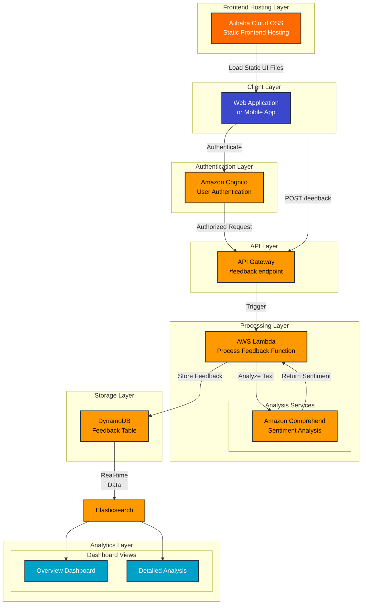

# AWS Customer Feedback Analysis System

## Project Overview

This project implements a real-time customer feedback analysis system using AWS services. It helps businesses automatically collect, analyze, and visualize customer feedback data, enabling faster response times and data-driven decision making. The system is particularly valuable for organizations dealing with high volumes of customer feedback that require immediate insights.

## Business Value

- **Real-time Analysis**: Automatically process customer feedback as it arrives, eliminating manual analysis bottlenecks
- **Consistent Evaluation**: Apply standardized sentiment analysis across all feedback
- **Quick Issue Detection**: Identify and escalate critical customer concerns immediately
- **Data-Driven Insights**: Generate actionable business intelligence through automated dashboard visualizations
- **Scalable Solution**: Handle varying volumes of feedback with AWS's elastic infrastructure

## Architecture



## Run the Feedback Simulator


```bash
# Edit .env to set your API GW Endpoints
npm install
npm run dev
```

Access the simulator at http://localhost:5173/


## License

Licensed under the Apache License, Version 2.0 (the "License");
you may not use this file except in compliance with the License.
You may obtain a copy of the License at

    http://www.apache.org/licenses/LICENSE-2.0

Unless required by applicable law or agreed to in writing, software
distributed under the License is distributed on an "AS IS" BASIS,
WITHOUT WARRANTIES OR CONDITIONS OF ANY KIND, either express or implied.
See the License for the specific language governing permissions and
limitations under the License.

Copyright 2024 Schmitech Inc.
